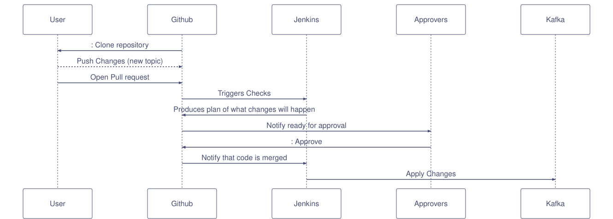

# KAFKA OPS DEMO

This is to demontrate what we can use to automate kafka operations such as adding ACLs, Topics and Topic Configs.

## Requrements

- [Terraform][terraform]
- [Kafka provider for terraform][terraform-kafka-provider]
- Optional
  - [docker-compose][docker-compose] will be required if wanting to run against a local instance of kafka

## Running Locally

```bash
# Bring up all services
./local-env/start-all.sh
# change into the dev directory
cd dev
# Initialise terraform
terraform init
# See what will change when terraform runs.
terraform plan
# Apply the changes
terraform apply
```

## Interfaces

| component       | port | url                     |
| ---             | ---  | ---                     |
| kafka           | 9092 |                         |
| kafka-rest      | 8082 | <http://localhost:8082> |
| kafka-topics-ui | 8000 | <http://localhost:8000> |
| jenkins         | 8080 | <http://localhost:8080> |

## Sequence Diagram

Diagrams are made with <http://chartmage.com/index.html>



## Demo Example

[](http://www.youtube.com/watch?v=qTIIJg81o-Q "demo kafka ops interaction terraform")

## Future work

- Integrate jenkins hook

[terraform]: https://www.terraform.io/
[terraform-kafka-provider]: https://github.com/Mongey/terraform-provider-kafka
[kafka-topics-ui]: https://github.com/Landoop/kafka-topics-ui
[docker-compose]: https://docs.docker.com/compose/
